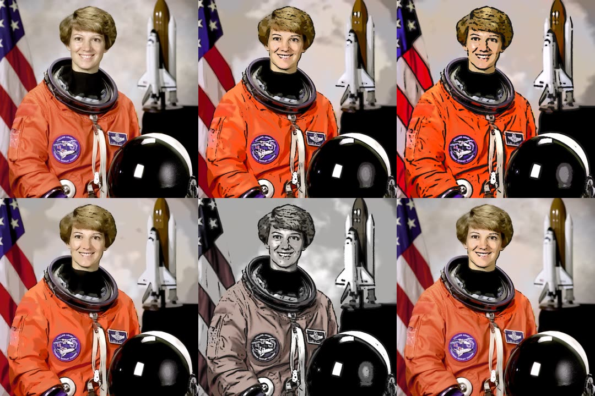
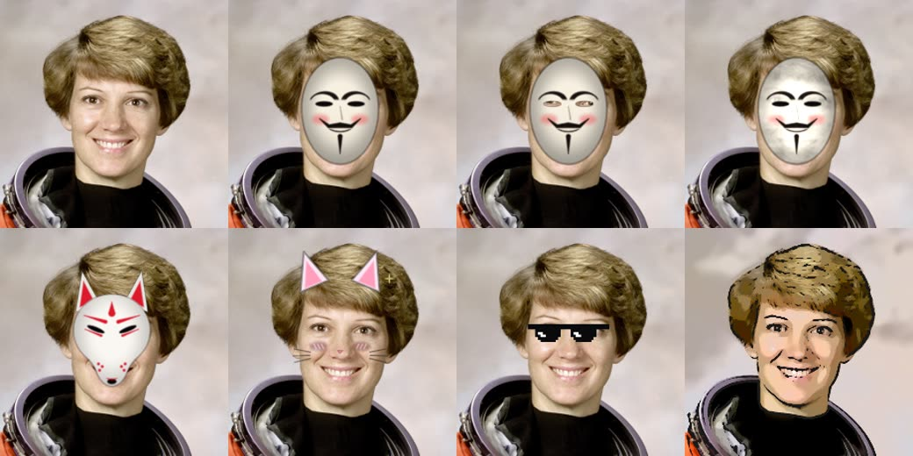

# OBS Zoom to Mouse & Lua Plugins

*Hướng dẫn dùng Lua script cho OBS Studio*

Bộ script Lua cho OBS Studio dành cho streamer và người làm video hướng dẫn. `obs-zoom-to-mouse.lua` nằm ở thư mục gốc, các plugin khác trong [`plugins/`](plugins). Không cần cài thêm gì: OBS có sẵn LuaJIT, chỉ việc thả file `.lua` vào là chạy.

| Script | Làm gì | Hợp với |
|---|---|---|
| [`obs-zoom-to-mouse.lua`](obs-zoom-to-mouse.lua) | Zoom màn hình theo con trỏ chuột, tự zoom khi click (kiểu Screen Studio), làm nét vùng zoom | Video hướng dẫn, dạy code, demo phần mềm |
| [`countdown-pro.lua`](plugins/countdown-pro.lua) | Đếm ngược "Starting soon" theo thời lượng hoặc tới giờ cố định, hết giờ tự chuyển scene | Mở đầu livestream |
| [`pomodoro-study.lua`](plugins/pomodoro-study.lua) | Đồng hồ Pomodoro, tự đổi scene Focus/Break, có âm báo | Stream "study with me", làm việc cùng nhau |
| [`afk-scene-switcher.lua`](plugins/afk-scene-switcher.lua) | Rời máy N phút thì tự chuyển sang scene BRB, quay lại thì tự về | Mọi buổi live |
| [`instant-replay.lua`](plugins/instant-replay.lua) | 1 phím: lưu Replay Buffer, phát lại ngay (có slow-motion) rồi tự quay về | Stream game, thể thao |
| [`chapter-markers.lua`](plugins/chapter-markers.lua) | Bấm phím đánh dấu chương khi Record/Stream, xuất file YouTube chapters + chapter trong MP4 | Video YouTube dài, podcast, khóa học |
| [`live-timer.lua`](plugins/live-timer.lua) | Hiện `🔴 LIVE 01:23:45` / `⏺ REC 00:10:02` lên màn hình | Mọi buổi live |
| [`text-ticker.lua`](plugins/text-ticker.lua) | Xoay vòng thông báo hoặc chạy chữ kiểu bản tin | Kêu gọi follow, lịch stream, nhà tài trợ |
| [`cartoon-face.lua`](plugins/cartoon-face.lua) | Một phím biến mặt/webcam thành hoạt hình (filter cel-shading), hoặc thay bằng avatar / app VTuber | Streamer ngại lộ mặt, kênh giải trí |
| [`face-mask.lua`](plugins/face-mask.lua) | Đeo mặt nạ Hacker (Anonymous), Kitsune (cáo), Neko (tai mèo) hoặc PNG riêng; đè lên ảnh gốc | Giấu mặt, stream vui, cosplay |
| [`smooth-scene-switcher.lua`](plugins/smooth-scene-switcher.lua) | Next/Prev scene với Slide tự đổi hướng, xếp hàng khi bấm dồn, playlist tự xoay, tự chuyển theo cửa sổ | Mọi buổi live nhiều scene |

Yêu cầu: **OBS Studio 28 trở lên** (khuyên dùng 30+). Chạy được trên Windows, macOS và Linux.

---

## 1. Cài một Lua script vào OBS

1. Tải file `.lua` về và để vào một thư mục **cố định** (đừng để trong Downloads rồi xóa đi; OBS chỉ nhớ đường dẫn). Gợi ý:
   - Windows: `C:\OBS-Scripts\`
   - macOS / Linux: `~/obs-scripts/`
2. Mở OBS → menu **Tools** → **Scripts**.
3. Ở tab **Scripts**, bấm nút **`+`** ở góc dưới bên trái và chọn file `.lua`.
4. Bấm vào tên script trong danh sách. Bảng cài đặt hiện ở bên phải: chỉnh ở đây.
5. Gán phím tắt: **File → Settings → Hotkeys**, gõ tên script vào ô lọc (ví dụ "zoom", "Countdown", "Pomodoro").

> Thêm hay sửa source/scene **sau khi** đã mở bảng cài đặt script thì danh sách chọn chưa có chúng. Bấm nút **⟳ (Reload Scripts)** ở góc dưới cửa sổ Scripts, hoặc đóng rồi mở lại cửa sổ.

### Xem log khi script không chạy

Trong cửa sổ **Tools → Scripts**, bấm **Script Log**. Mọi lỗi Lua và thông báo của script đều hiện ở đây. Với zoom-to-mouse, bật **Enable debug logging** để xem chi tiết.

### Gỡ / tạm tắt

Chọn script và bấm nút **`−`**. Script nào chỉnh scene hoặc source (zoom-to-mouse) sẽ tự trả lại transform gốc khi bị gỡ.

---

## 2. Zoom to Mouse v1.2.0

Bản fork của [BlankSourceCode/obs-zoom-to-mouse](https://github.com/BlankSourceCode/obs-zoom-to-mouse), bảo trì tại [nguyenquocanhz/zoom-to-mouse](https://github.com/nguyenquocanhz/zoom-to-mouse).

### Thiết lập nhanh

1. Thêm một **Display Capture** (Windows/macOS) hoặc **Screen Capture (XSHM)** (Linux X11) vào scene.
2. Tools → Scripts → `+` → `obs-zoom-to-mouse.lua`.
3. **Zoom Source**: chọn Display Capture vừa tạo.
4. Settings → Hotkeys:
   - **Toggle zoom to mouse**: bật/tắt zoom (ví dụ `Ctrl+Shift+Z`)
   - **Toggle follow mouse during zoom**: bật/tắt khung bám theo chuột
   - **Zoom to mouse: zoom in more / zoom in less**: phóng to/thu nhỏ thêm khi đang zoom
5. Muốn không phải bấm phím thì bật **Auto zoom on click**: click chuột trái là tự zoom vào chỗ vừa click, để yên chuột vài giây là tự zoom ra.

### Các tùy chọn

| Tùy chọn | Ý nghĩa | Gợi ý |
|---|---|---|
| Zoom Factor | Mức phóng to (1–10×) | 2 cho màn 1080p, 2.5–3 cho màn 4K |
| Zoom Step (hotkey) | Mỗi lần bấm zoom more/less thay đổi bao nhiêu | 0.5 |
| Zoom Speed | Tốc độ animation zoom vào/ra | 0.04–0.08 |
| **Scale filter while zoomed** | Bộ lọc phóng ảnh khi đang zoom | **Lanczos** (nét nhất) |
| **Sharpen while zoomed** | Độ làm nét, tăng dần theo mức zoom (0 = tắt) | 0.1–0.2 |
| Auto zoom on click | Click chuột trái trong vùng màn hình thì tự zoom | Bật cho video hướng dẫn |
| Auto zoom out after (s) | Không động chuột bao nhiêu giây thì tự zoom ra (0 = không bao giờ) | 2–4 giây |
| Auto follow mouse | Khung tự bám chuột khi đang zoom | Bật |
| Follow Speed | Tốc độ khung đuổi theo chuột | 0.15–0.3 |
| Follow Border | Chuột vào sát mép bao nhiêu % thì khung bắt đầu chạy theo | 5–15 |
| Lock Sensitivity | Khung chạy tới gần chuột bao nhiêu px thì đứng yên | 4 |
| Auto Lock on reverse direction | Kéo chuột ngược lại thì khung dừng (giống kéo camera trong game RTS) | Tùy thích |
| Allow any zoom source | Cho zoom cả source không phải Display Capture (webcam, window capture...) | Khi bật phải nhập **Set manual source position** |
| Dùng màn hình đang có chuột | Nút (đếm 3 giây) / phím tắt: tự điền vị trí, kích thước, tỉ lệ của màn hình đang có chuột | Khi zoom lệch ở màn hình rời |
| Set manual source position | Tự nhập vị trí và kích thước màn hình khi script không tự đoán được | Dùng khi zoom bị lệch |

### Zoom bị mờ: vì sao và cách làm nét

Khi zoom 2× trên màn 1080p, OBS cắt một vùng 960×540 rồi **phóng nó lên 1920×1080**. Vùng đó chỉ có 1/4 số điểm ảnh, nên dù làm gì cũng không thể nét như ảnh gốc. Nhưng có thể làm nó **trông nét hơn nhiều**:

1. **Scale filter = Lanczos** (mặc định từ v1.1.0). OBS mặc định phóng ảnh bằng *bilinear* nên chữ bị nhòe. Lanczos giữ cạnh chữ sắc hơn rõ rệt. Script chỉ đổi khi đang zoom và trả lại như cũ khi zoom ra.
2. **Sharpen while zoomed = 0.1–0.2**. Script tự thêm filter Sharpen, độ nét tăng dần theo mức zoom (đầy đủ ở 2×) và tự tắt khi zoom ra. Đẩy quá 0.3 sẽ bị viền răng cưa.
3. **Quay màn hình độ phân giải cao hơn canvas.** Đây là cách duy nhất cho zoom *thật sự* nét. Màn 4K + canvas 1080p: zoom 2× vẫn đủ 1920×1080 điểm ảnh thật, gần như không mất chi tiết. Chỉnh ở *Settings → Video*: **Base (Canvas) Resolution** = độ phân giải màn hình, **Output (Scaled) Resolution** = 1920×1080, **Downscale Filter** = Lanczos.
4. **Đừng zoom quá tay**: trên màn 1080p, 1.5–2× là hợp lý. Từ 3× trở lên chữ sẽ to nhưng vỡ.
5. **Đủ bitrate**: lúc khung chạy theo chuột, cả hình thay đổi liên tục. Bitrate thấp thì hình bị nhòe khi chuyển động. Ghi video nên dùng CQP/CRF khoảng 18–20; stream 1080p60 nên từ 6000 Kbps.
6. Tăng font hệ thống / zoom IDE (Ctrl + `+`) trước khi quay. Đây vẫn là cách rẻ nhất để chữ nét.

### v1.2.0: sửa zoom ở màn hình rời

- **Đổi Display Capture sang màn khác thì zoom lệch hẳn**: vị trí màn hình chỉ được tính một lần lúc chọn Zoom Source. Giờ được kiểm lại trước mỗi lần zoom, kể cả khi đổi sang màn cùng độ phân giải.
- **Đổi độ phân giải hoặc sửa crop filter của Display Capture** cũng làm zoom lệch cho tới khi đổi scene. Giờ được phát hiện và thiết lập lại tự động.
- **Màn rời có tên không đúng định dạng** (một số driver/cách capture) thì mất offset, zoom bị dồn về màn chính. Giờ dò theo danh sách màn hình của hệ điều hành.
- **macOS**: tọa độ chuột bị lật theo chiều cao của màn đang capture thay vì màn chính, nên lệch trên màn rời khác chiều cao. Màn Retina bị nhầm point với pixel. Giờ dùng CoreGraphics cho cả chuột lẫn màn hình.
- Hệ số scale (Retina, source bị scale) được áp **trước** khi trừ offset crop filter (trước đây làm ngược, lệch khi có crop).
- Không còn báo nhầm `ERROR: Nguồn zoom không phải là Display Capture` lúc OBS mới khởi động.
- **Windows, hai màn khác Scale** (vd laptop 150%, màn rời 100%): tọa độ chuột có thể bị Windows quy đổi theo DPI, lệch với pixel thật của màn rời. Giờ đọc bằng `GetPhysicalCursorPos` và đọc màn hình ở chế độ per-monitor DPI.
- Mới: nút / phím **Dùng màn hình đang có chuột** để tự hiệu chỉnh.

### Những gì đã sửa/thêm so với v1.0.1

**Sửa lỗi**
- **Transform gốc không được khôi phục.** Khi đổi scene, đổi source hoặc gỡ script, code gọi `obs_sceneitem_get_info2` (đọc) thay vì `obs_sceneitem_set_info2` (ghi), nên source bị kẹt ở bounding box do script tự chuyển đổi. Giờ đã trả đúng transform gốc.
- **Đọc vượt danh sách màn hình** (`for i = 0, item_count`): bị lệch 1, đọc một phần tử không tồn tại.
- **`is_display_capture` luôn trả `true`** khi tắt "Allow any zoom source". Giờ kiểm tra đúng loại source.
- **Khung follow luôn hụt 1px ở mép màn hình**: lerp tiến tiệm cận rồi bị `floor()`. Giờ snap về đích khi còn cách dưới nửa pixel.
- **Tốc độ zoom/follow phụ thuộc FPS**: canvas 30fps zoom chậm gấp đôi 60fps. Giờ tính theo thời gian thực.
- **Easing sai**: bản cũ lerp từ vị trí *hiện tại* với hệ số đã ease, nên đường cong thực tế khác hẳn ease-in-out. Giờ lerp từ điểm bắt đầu animation.
- Tắt follow khi đang zoom thì timer vẫn chạy mỗi frame dù không làm gì. Giờ timer dừng hẳn.
- Thoát OBS / đổi Scene Collection lúc đang zoom thì filter crop bị lưu luôn vào scene. Giờ dọn trước khi OBS lưu.
- Máy Linux thiếu thư viện X11 thì script lỗi ngay khi load. Giờ chỉ báo cảnh báo.

**Tối ưu**
- Chỉ gọi `obs_source_update` khi giá trị crop (pixel nguyên) thật sự đổi. Lúc khung đứng yên hoặc animation chậm thì gần như không tốn gì.

**Tính năng mới**
- **Auto zoom on click** + tự zoom ra khi để yên chuột (Windows, macOS, Linux X11).
- Hotkey **zoom in more / zoom in less** để đổi mức zoom ngay khi đang zoom.
- Bấm hotkey giữa lúc đang animation sẽ **đảo chiều** ngay tại chỗ, không phải chờ animation xong.
- **Scale filter Lanczos + Sharpen** khi zoom (xem phần trên).
- Tìm Zoom Source cả trong **Group**, không chỉ trong nested scene.
- Hỗ trợ OBS 28–29 (tự dùng `obs_sceneitem_get_info` nếu không có bản `...2`).
- Zoom Factor tối đa 10×, bước 0.1.

### Giới hạn

- **Linux Wayland**: không đọc được vị trí chuột của hệ thống. Hãy đăng nhập phiên X11 ("Ubuntu on Xorg").
- macOS: lần đầu có thể cần cấp quyền *Accessibility / Input Monitoring* cho OBS thì auto zoom on click mới nhận click.
- Nhiều màn hình: xem mục *Màn hình rời* ngay dưới.

### Màn hình rời (external monitor)

Từ v1.2.0 script tự lấy danh sách màn hình từ hệ điều hành (Windows: `EnumDisplayMonitors`, Linux: XRandR, macOS: CoreGraphics). Nhờ đó nó biết Display Capture đang chụp màn nào, kể cả màn đặt bên trái/phía trên màn chính (tọa độ âm), màn có độ phân giải khác, hay màn Retina trên Mac. Mỗi lần zoom, script kiểm lại xem bạn có vừa đổi Display Capture sang màn khác không.

Nếu zoom ở màn rời vẫn lệch:
1. Trong cài đặt script, bấm **Dùng màn hình đang có chuột (sau 3 giây)** rồi đưa chuột sang màn rời và để yên. Sau 3 giây script tự điền *Set manual source position* cho đúng màn đó. Kiểm tra trong **Script Log** dòng `Dùng màn hình tại X,Y (WxH, scale S)`.
   - Hoặc gán phím **Zoom to mouse: dùng màn hình đang có chuột** trong Hotkeys, đưa chuột sang màn rời rồi bấm.
2. Đổi Display Capture sang màn khác về sau thì bỏ tích **Set manual source position** để script tự dò lại (hoặc hiệu chỉnh lại như bước 1).
3. Vẫn lệch: bật **Enable debug logging**, zoom một lần, rồi gửi các dòng `Monitor (...)` và `Mouse ... -> source ...` trong Script Log để kiểm tra.

---

## 3. Countdown Pro

1. Thêm một **Text (GDI+)** (Windows) hoặc **Text (FreeType 2)** (macOS/Linux) vào scene "Starting soon".
2. Load `countdown-pro.lua`, chọn **Text source**.
3. **Chế độ**:
   - *Đếm theo thời lượng*: nhập Phút/Giây.
   - *Đếm tới giờ cố định*: nhập `20:00`. Nếu giờ đó đã qua trong hôm nay thì đếm tới 20:00 ngày mai.
4. **Mẫu hiển thị**: `Bắt đầu sau {time}`. **Chữ khi hết giờ**: `Bắt đầu thôi!`
5. **Hết giờ chuyển sang scene**: chọn scene chính để tự vào live.
6. Bật **Tự chạy khi Text source hiện trên Program**: chuyển sang scene Starting soon là đồng hồ tự chạy.

Hotkey: *Countdown: Start / Pause*, *Reset*, *+1 phút* (khi cần thêm thời gian chờ người xem).

## 4. Pomodoro Study

1. Tạo Text source cho đồng hồ. Tùy chọn: thêm scene **Study** và **Break**, và một **Media Source** chứa tiếng chuông (bỏ chọn *Loop*).
2. Load `pomodoro-study.lua`, chọn Text source, scene và âm báo.
3. Mặc định 25/5/15 phút, 4 vòng thì nghỉ dài.
4. Biến dùng trong mẫu: `{label}` `{time}` `{cycle}` `{total}` `{done}`. Ví dụ: `{label} {time} · Pomodoro #{done}`.

Hotkey: *Start/Pause*, *Skip pha*, *Reset*. Bỏ **Tự chạy pha tiếp theo** nếu muốn mỗi pha phải bấm Start.

## 5. AFK Scene Switcher

1. Tạo scene **BRB** (ảnh "Be right back", nhạc chờ...).
2. Load `afk-scene-switcher.lua`, chọn **Scene BRB**, đặt **Rảnh bao lâu thì chuyển** (ví dụ 3 phút).
3. Bật **Chỉ khi đang Stream/Record** để lúc chuẩn bị không bị nhảy scene.

Script đo thời gian rảnh của **cả chuột lẫn bàn phím** trên toàn hệ thống. Tay cầm chơi game không được tính, nên chơi bằng tay cầm thì đặt thời gian dài hơn hoặc tắt bằng hotkey *AFK switcher: Bật/Tắt*. Đang ở BRB mà bạn tự chuyển sang scene khác thì script không giành lại.

Linux cần `libxss1` (`sudo apt install libxss1`) để tính cả bàn phím. Nếu thiếu, script chỉ dựa vào chuyển động chuột.

## 6. Instant Replay

1. **Settings → Output → Replay Buffer**: bật, đặt *Maximum Replay Time* (ví dụ 20s).
2. Tạo scene **Replay** và thêm một **Media Source** (tạm để trống file, bỏ *Loop*).
3. Load `instant-replay.lua`, chọn Media source và scene Replay. **Tốc độ phát** = 50% để có slow-motion.
4. Bấm **Start Replay Buffer** trong Controls (hoặc để script tự bật).
5. Gán hotkey *Instant Replay: Lưu & phát lại*. Bấm là OBS lưu đoạn vừa xảy ra, chuyển sang scene Replay, phát xong tự về scene cũ.

Đang xem replay mà bạn tự chuyển scene thì script không kéo bạn về nữa.

## 7. Chapter Markers (YouTube chapters)

1. Load `chapter-markers.lua`, chọn **Tính giờ theo**: *Recording* (video quay) hoặc *Stream* (VOD livestream).
2. Soạn sẵn **Agenda**: mỗi dòng một tên chương. Mỗi lần bấm hotkey sẽ lấy tên kế tiếp; hết agenda thì dùng `Chapter {n}`.
3. Gán hotkey *Chapter: Thêm chương* (và *Xóa chương cuối* khi bấm nhầm).
4. Khi dừng ghi, file `chapters_YYYY-MM-DD_HH-MM-SS.txt` nằm trong thư mục Recording (hoặc thư mục bạn chọn). Dán nội dung vào mô tả YouTube.

YouTube chỉ hiện chapters khi có **ít nhất 3 chương**, chương đầu là `00:00`, và mỗi chương **dài tối thiểu 10 giây**. Script sẽ cảnh báo trong Script Log nếu vi phạm.

Nếu ghi bằng **Hybrid MP4** (Settings → Output → Recording Format, OBS 30.2+), chapter còn được ghi thẳng vào file video. Lưu ý: *Xóa chương cuối* chỉ xóa trong file .txt, không xóa được chapter đã ghi vào MP4.

## 8. Live Timer

Load `live-timer.lua` và chọn Text source. Biến dùng trong mẫu: `{stream}`, `{rec}`. Lúc offline, chữ để trống (hoặc nội dung bạn đặt). Reload script giữa buổi live vẫn tính gần đúng giờ, vì script ước lượng từ số frame OBS đã gửi.

## 9. Text Ticker

1. Load `text-ticker.lua`, chọn Text source.
2. Nhập thông báo vào **Danh sách** và/hoặc chọn một file `.txt` (mỗi dòng một câu; sửa file là tự cập nhật, không cần reload).
3. **Xoay vòng từng câu**: đổi câu sau N giây (có xáo trộn, không lặp hai câu liền nhau).
4. **Ghép một dòng**: nối tất cả bằng dấu `•`. Thêm filter **Scroll** vào Text source (chuột phải → Filters → `+` → Scroll, Horizontal Speed ~ 60) là thành dòng chữ chạy kiểu bản tin.

## 10. Cartoon Face — biến mặt thành hoạt hình



*Ảnh chụp từ OBS 30 thật khi chạy filter. Hàng trên: ảnh gốc, Anime, Comic. Hàng dưới: Hoạt hình mềm, Sketch, Anime chỉ áp vào vùng mặt. Ảnh mẫu: NASA, public domain.*

Gồm hai phần, dùng riêng hay kết hợp đều được:

**a) Filter "Cartoon Face (Hoạt hình)"**: shader chạy trên GPU, gần như không tốn CPU.
1. Load `cartoon-face.lua` (Tools → Scripts → `+`).
2. Chuột phải webcam → **Filters** → `+` → **Cartoon Face (Hoạt hình)**.
3. Chọn **Kiểu**: Anime, Truyện tranh, Hoạt hình mềm, Phác thảo; hoặc *Tùy chỉnh* rồi kéo từng thanh:
   - *Số dải màu*: ít thì màu phẳng như tranh vẽ, nhiều thì gần ảnh thật.
   - *Làm mịn da*, *Độ rực màu*.
   - *Độ đậm / ngưỡng / độ dày viền*: ngưỡng thấp thì nhiều nét hơn. *Màu viền* đổi được.
   - *Độ mạnh*: trộn với ảnh gốc, ví dụ 60% cho hiệu ứng nhẹ.
4. **Chỉ áp vào vùng mặt**: bật lên rồi đặt tâm, rộng, cao của hình elip cho trùng mặt bạn, chỉnh *Viền mờ* để chỗ chuyển tiếp mềm. Phần còn lại (phòng, áo...) giữ nguyên.

**b) Một phím bật/tắt** (cài đặt của script):
1. **Webcam**: chọn source camera.
2. **Cách biến hình**:
   - *Filter hoạt hình lên webcam*: phím tắt bật/tắt filter. Webcam chưa có filter thì script tự thêm.
   - *Thay webcam bằng avatar*: phím tắt ẩn webcam và hiện **Avatar** (ảnh PNG/GIF, video, hoặc cửa sổ app VTuber) ở mọi scene có webcam. Đặt avatar trùng vị trí webcam trong từng scene.
3. Settings → Hotkeys → **Cartoon Face: Bật/Tắt**.

**Giới hạn và cách khắc phục**: Lua trong OBS không chạy được AI nhận diện khuôn mặt, nên script **không tự dò mặt** của bạn.
- Vùng elip đứng yên. Muốn nó bám theo mặt, cài thêm plugin [Face Tracker](https://github.com/norihiro/obs-face-tracker) (norihiro) để giữ mặt luôn ở giữa khung, rồi đặt elip ở giữa.
- Muốn **avatar hoạt hình cử động theo mặt** (chớp mắt, mấp máy môi): dùng app VTuber miễn phí như **VTube Studio**, **Animaze** (tracking bằng webcam), hoặc **Veadotube mini** (PNGTuber: ảnh tĩnh nhép miệng theo mic). Đưa app vào OBS bằng *Window/Game Capture* (nền trong suốt hoặc chroma key), rồi chọn source đó làm **Avatar** để một phím chuyển qua lại giữa mặt thật và avatar.

## 11. Face Mask — mặt nạ Hacker / Kitsune / Neko



*Ảnh chụp từ OBS 30 thật. Ô cuối là Cartoon Face để so sánh.*

1. Load `face-mask.lua`, chọn **Webcam** trong cài đặt script.
2. Settings → Hotkeys:
   - **Face Mask: Bật/Tắt**: lần đầu bấm, script tự thêm filter vào webcam.
   - **Face Mask: Mặt nạ tiếp theo**: Hacker → Kitsune → Neko → Ảnh PNG → Hacker...
3. Chuột phải webcam → **Filters** → **Face Mask (Mặt nạ)** để chỉnh:
   - **Mặt nạ**:
     - *Hacker (Anonymous)*: mặt nạ trắng ria vểnh.
     - *Kitsune*: mặt nạ cáo Nhật, kiểu anime.
     - *Neko*: tai mèo, má hồng `///`, ria mèo, vẫn lộ mặt. Đổi được *Màu tai*.
     - *Ảnh PNG của tôi*: chọn file PNG nền trong suốt (kính râm, mặt nạ, sticker...).
   - **Tâm mặt X/Y, Cỡ, Xoay**: kéo cho mặt nạ trùng mặt bạn. *Cỡ* = chiều cao mặt (trán → cằm) tính theo % chiều cao khung.
   - **Khoét lỗ mắt** (Hacker/Kitsune): thấy mắt thật qua mặt nạ, trông như đeo mặt nạ thật.
   - **Kiểu phủ**:
     - *Đè lên gốc*: mặt nạ che kín.
     - *Hòa vào da*: mặt nạ nhận ánh sáng, bóng đổ của phòng, bớt cảm giác dán lên.
   - **Độ đậm**: làm mặt nạ trong mờ.

**Đè lên ảnh gốc** (cài đặt script, mặc định bật): khi đeo mặt nạ, script tạm tắt Cartoon Face trên cùng webcam và đưa mặt nạ lên lớp trên cùng. Mặt nạ vì thế nằm trên hình camera thật, không bị filter hoạt hình vẽ đè. Tháo mặt nạ thì Cartoon Face bật lại. Cartoon Face nào bạn đã tự tắt từ trước thì vẫn để tắt. Muốn mặt nạ *và* hoạt hình cùng lúc thì bỏ chọn ô này.

Giống Cartoon Face, script **không tự dò mặt**: mặt nạ nằm ở vị trí bạn đặt. Ngồi yên trước camera là đủ; muốn bám theo khi di chuyển thì thêm plugin [Face Tracker](https://github.com/norihiro/obs-face-tracker) để giữ mặt ở giữa khung.

## 12. Smooth Scene Switcher — chuyển scene mượt

1. Load `smooth-scene-switcher.lua`.
2. **Thứ tự scene**: thêm tên scene theo thứ tự muốn lật (để trống = theo danh sách OBS).
3. **Transition khi Next / Prev**: ví dụ chọn *Slide* cho cả hai. Muốn có Slide thì thêm ở khung *Scene Transitions* → `+` → *Slide*. Đặt **Thời lượng** (300–600ms là mượt).
4. Settings → Hotkeys: **Smooth Switcher: Scene tiếp theo / Scene trước**. Gán vào phím, Stream Deck hoặc bàn đạp.

Vì sao mượt hơn chuyển scene thường:
- **Slide/Swipe tự đổi hướng**: Next trượt sang trái, Prev trượt sang phải, như lật trang.
- **Bấm dồn không bị giật**: bấm khi transition đang chạy thì lệnh được xếp hàng và chạy ngay khi transition xong, không cắt ngang giữa chừng. Bấm 3 lần là đi tới 3 scene.
- **Không đụng thiết lập của bạn**: transition và thời lượng riêng chỉ dùng lúc chuyển, xong tự trả lại cái bạn đang chọn.
- Hỗ trợ **Studio Mode**: đưa scene vào Preview rồi chạy transition.

Thêm:
- **Playlist**: hotkey *Playlist Bật/Tắt* tự xoay qua các scene mỗi N giây. Dùng cho màn hình chờ nhiều slide, podcast nhiều góc máy.
- **Tự chuyển theo cửa sổ** (Windows, Linux X11): mỗi dòng `chữ trong tiêu đề => Tên scene`, ví dụ:
  ```
  Visual Studio Code => Code
  League of Legends => Game
  Discord => Just Chatting
  ```
  Script chỉ chuyển khi bạn **đổi sang cửa sổ khác**, nên tự bấm đổi scene lúc đang ở cùng cửa sổ thì không bị giành lại. Không phân biệt hoa thường.

Transition có thời lượng cố định (Stinger) thì đặt **Thời lượng** bằng độ dài stinger, để lệnh xếp hàng chạy đúng lúc.

---

## 13. Tự viết Lua script cho OBS

Khung tối thiểu:

```lua
local obs = obslua

-- Mô tả hiện ở đầu bảng cài đặt (được dùng HTML đơn giản)
function script_description()
    return "<b>Hello OBS</b><br>Ví dụ script tối giản"
end

-- Các ô cài đặt
function script_properties()
    local props = obs.obs_properties_create()
    obs.obs_properties_add_text(props, "message", "Nội dung", obs.OBS_TEXT_DEFAULT)
    obs.obs_properties_add_button(props, "say", "Ghi ra log", function()
        obs.script_log(obs.OBS_LOG_INFO, "Đã bấm nút")
        return false
    end)
    return props
end

-- Giá trị mặc định
function script_defaults(settings)
    obs.obs_data_set_default_string(settings, "message", "Xin chào")
end

-- Chạy mỗi khi người dùng đổi cài đặt (và một lần sau khi load)
function script_update(settings)
    local msg = obs.obs_data_get_string(settings, "message")
    obs.script_log(obs.OBS_LOG_INFO, msg)
end

function script_load(settings) end   -- đăng ký hotkey, event, timer
function script_save(settings) end   -- lưu hotkey
function script_unload() end          -- dọn dẹp
```

Các quy tắc phải nhớ:

- **Mọi thứ lấy bằng `get`/`create` đều phải `release`.** Ví dụ `obs_get_source_by_name` → `obs_source_release`, `obs_data_create` hoặc `obs_source_get_settings` → `obs_data_release`, `obs_enum_sources` / `obs_frontend_get_scenes` → `source_list_release`. Quên release thì rò bộ nhớ và OBS cảnh báo khi thoát.
- **Không dùng vòng lặp chờ (sleep).** Dùng `obs.timer_add(fn, ms)` / `obs.timer_remove(fn)`, hoặc định nghĩa `script_tick(seconds)` (chạy mỗi frame, cần giữ thật nhẹ).
- **Đo thời gian bằng `obs.os_gettime_ns()`**, không bằng số lần timer chạy, vì timer có thể bị trễ. Xem cách pomodoro nối pha theo mốc kết thúc thật để không bị trôi giờ.
- **Hotkey**: `obs_hotkey_register_frontend(id, mô_tả, callback)` trong `script_load`, rồi `obs_hotkey_load` (đọc lại phím đã gán) và `obs_hotkey_save` trong `script_save`.
- **Sự kiện OBS** (bắt đầu stream, đổi scene...): `obs_frontend_add_event_callback(fn)` và so sánh với `obs.OBS_FRONTEND_EVENT_*`.
- **Gọi API hệ điều hành** qua LuaJIT FFI (`require("ffi")`), như zoom-to-mouse đọc vị trí chuột hay AFK switcher đọc thời gian rảnh. Bọc `ffi.load` bằng `pcall` để máy thiếu thư viện không làm script chết.
- Hàm dùng làm callback (timer, hotkey, event) phải là hàm **global** hoặc được tham chiếu cố định. Muốn `timer_remove` được thì phải truyền đúng hàm đã `timer_add`.
- **Tránh deadlock (lỗi treo OBS)**: script đã gọi `obs_frontend_add_event_callback` thì **không được** gọi `obs_frontend_set_current_scene`, `obs_frontend_set_current_transition`, `obs_frontend_set_current_preview_scene`... từ hotkey hoặc timer.
  - Lý do: các hàm này chờ luồng giao diện chạy xong. Luồng giao diện lại gọi event callback của script, mà mọi callback của một script dùng chung một khóa. Hai bên chờ nhau nên OBS treo cứng.
  - Lỗi này đã gặp thật khi viết Smooth Switcher và Instant Replay, và chỉ lộ ra khi chạy OBS thật.
  - Cách tránh: chuyển scene ngay *trong* event callback, hoặc bỏ event callback và thay bằng hỏi trạng thái định kỳ (polling) trong timer.

Tài liệu chính thức: [OBS Python/Lua Scripting](https://docs.obsproject.com/scripting) · [Frontend API](https://docs.obsproject.com/reference-frontend-api) · [Source API](https://docs.obsproject.com/reference-sources).

---

## 14. Test

Test chạy bằng LuaJIT (cùng engine Lua mà OBS dùng) với một bản giả lập `obslua` ([`tests/mock_obs.lua`](tests/mock_obs.lua)), nên không cần mở OBS:

```bash
sudo apt install luajit         # macOS: brew install luajit
tests/run.sh                    # kiểm cú pháp + chạy toàn bộ test
python3 tests/mutate.py         # mutation test: cài lỗi vào script, test phải đỏ

# Chạy trong OBS THẬT (Linux, headless): load toàn bộ script, chụp ảnh filter Cartoon Face
sudo apt install obs-studio xvfb ffmpeg xdotool && pip install websocket-client
python3 tests/e2e_obs.py ảnh_mặt.png out/
python3 tests/demo_record.py out/   # quay video Zoom to Mouse: phím F9/F10/F11, di chuột, click — tất cả bằng xdotool
```

`mutate.py` cài lại từng lỗi thật vào một bản sao script (gồm cả các lỗi của zoom-to-mouse v1.0.1 ở trên) và yêu cầu test phải **đỏ**. Mutant nào vẫn xanh nghĩa là test đang hở chỗ đó. Lượt đầu chạy có 14/42 mutant sống sót; viết thêm test cho tới khi bắt được hết thì lộ ra một lỗi thật (pomodoro trôi vài giây sau mỗi chục pha). Hiện tại 84/84 mutant đều bị bắt, kể cả mutant cài lại lỗi deadlock (mock mô phỏng luôn luật khóa của OBS) và các lỗi màn hình rời của v1.1.0.

`e2e_obs.py` mở OBS thật trên màn hình ảo (Xvfb, render bằng Mesa) và load cả 11 script. Qua obs-websocket, nó:
- dùng `xdotool` đưa chuột thật tới một điểm trên Screen Capture (XSHM), bấm phím zoom và kiểm crop filter; bấm phím "dùng màn hình đang có chuột" để đọc màn hình qua XRandR;
- gắn Cartoon Face và Face Mask vào ảnh mẫu, chụp ảnh từng kiểu;
- bấm hotkey đeo mặt nạ, kiểm thứ tự filter;
- bấm Next/Prev của Smooth Switcher, kiểm hướng Slide, thời lượng, xếp hàng, trả lại transition;
- bật Replay Buffer và chạy trọn Instant Replay.

Test đỏ khi: một script không load được, log OBS có lỗi Lua, shader không biên dịch được, filter không làm ảnh thay đổi, hoặc một bước điều khiển ra sai kết quả. Đã thử cố ý làm hỏng shader (đỏ: `Error compiling shader`) và cài lại event callback gây deadlock (đỏ: OBS treo, websocket hết thời gian chờ). Đã chạy xanh trên OBS 30.0.2.

Phần đọc chuột, click, thời gian rảnh (FFI) và phím tắt vẫn cần thử tay trên máy thật.

## Lịch sử phiên bản Zoom to Mouse

v1.2.0 (sửa màn hình rời) và v1.1.0: xem [mục 2](#2-zoom-to-mouse-v120).

### v1.0.1 (Optimized Version)

*   **Fix Toggle Key:** Xử lý triệt để lỗi không nhận phím tắt Bật/Tắt bằng cơ chế quản lý trạng thái (boolean toggle) ổn định trong on\_toggle\_key.
    
*   **Cập nhật OBS API (v29.1+):** Thay thế hàm cũ bằng obs\_sceneitem\_get\_info2 và obs\_sceneitem\_set\_info2 để ngăn chặn lỗi Crash và triệt tiêu các cảnh báo (warnings) trên các phiên bản OBS Studio mới.
    
*   **Tối ưu hóa hiệu năng (Optimize Frame):**
    
    *   **Early Return:** Thuật toán thông minh tự động bỏ qua tính toán (dừng script\_tick) khi Zoom đang tắt và tỷ lệ scale đã về mặc định, giúp giải phóng 100% CPU/GPU cho tác vụ này.
        
    *   **FFI Memory Optimization:** Cấp phát bộ nhớ FFI (cursor\_pt) một lần duy nhất thay vì 60 lần/giây, loại bỏ hoàn toàn hiện tượng rác RAM (Garbage Collection).
        
    *   **Scene Item Caching:** Lưu trữ cache của Source thay vì vòng lặp quét (find source) liên tục mỗi khung hình.
        

## Tín dụng & Bản quyền

*   **Tác giả kịch bản Zoom to Mouse gốc:** [@BlankSourceCode](https://github.com/BlankSourceCode/obs-zoom-to-mouse)
*   **Tối ưu, cải tiến & các plugin khác:** [@nguyenquocanhz](https://github.com/nguyenquocanhz)
*   **Giấy phép:** MIT, xem [LICENSE](LICENSE)
